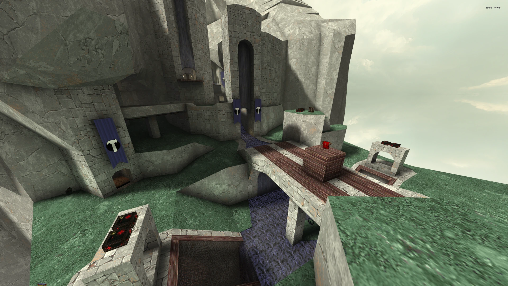
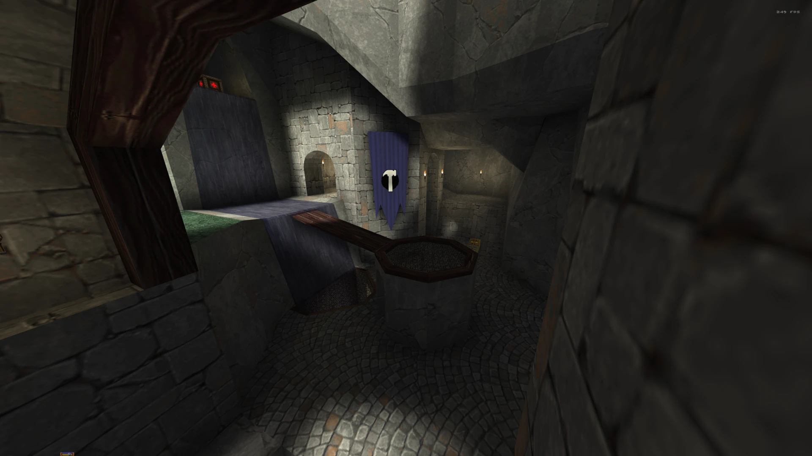
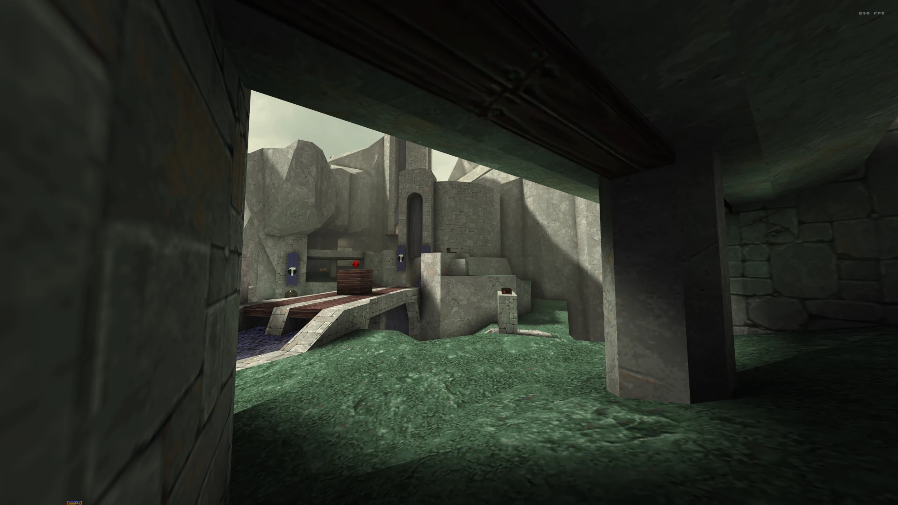
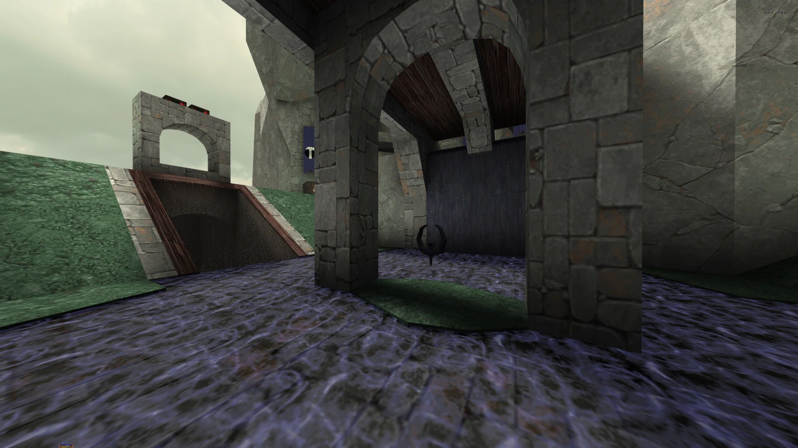
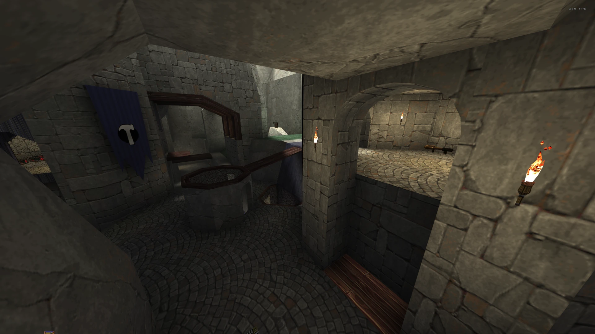

<h1 align="center">

CTF-Outside
</h1>

This is a Quake port of the Unreal Tournament 4 map CTF-Outside, which was the prototype for the final map CTF-Titanpass. The map is intended to be played with the [KTX](https://github.com/QW-Group/ktx) setting `k_ctf_based_spawn` set to `1`, and might perhaps be even more interesting without hook enabled.

## Porting

The port was made manually brush by brush without any form of automation and is thus not identical to CTF-Outside, neither geometry nor textures, but fairly close.

## Screenshots

## Trivia

A collection of links to further explore of the origins of this map.

#### Blog post

* [The Art of Titan Pass](https://www.epicgames.com/unrealtournament/en-US/blog/the-art-of-titan-pass)

#### ArtStation

* [Rick Kohler, Art Director](https://rek23.artstation.com/projects/A2OqV)
* [Adam Wood, Concept Artist](https://www.artstation.com/artwork/mA4X1)

#### Videos

A three part series _The Making of Titan Pass_

  
_CTF Exhibition Tournament_ at Epic Games HQ featuring an early version of CTF-Titanpass

## License

Creative Commons Zero (CC0), _"No Rights Reserved"_.
